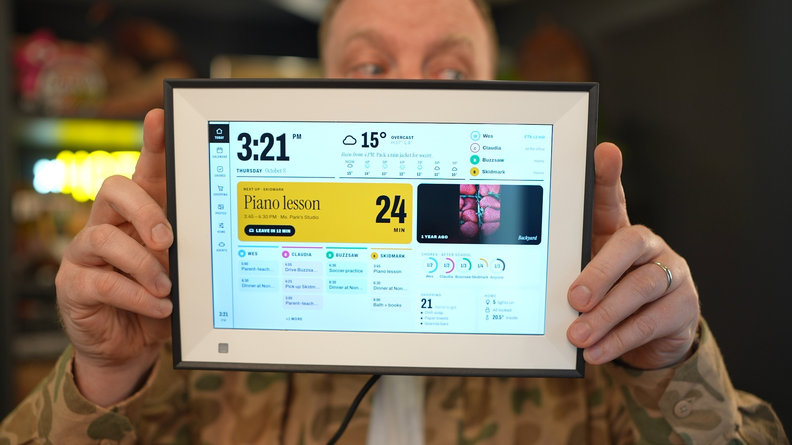

# Taking over Android photo frames

▶️ **Watch the video: [https://youtu.be/ZLycoUMltNI](https://youtu.be/ZLycoUMltNI)**

If you are coming from reddit or youtube, you can purchase almost any photo frame from amazon. This is the one, I used: [https://amzn.to/4zneGNM](https://amzn.to/4zneGNM) (amazon aff link)

Notes and scripts from getting full control of two locked-down Android displays: getting ADB,
backing up the firmware, getting root, removing the vendor app, and running our own launcher,
browser and kiosk app.

|                    | Skylight Calendar 15" (150-CAL)                                | BIUFRAME 10.1" picture frame                     |
| ------------------ | -------------------------------------------------------------- | ------------------------------------------------ |
| SoC / Android      | Rockchip RK3566, Android 12                                    | Rockchip RK3126, Android 6.0.1                   |
| USB name / IDs     | `rockchip D156`, `2207:0007` (MTP) → `2207:0006` (ADB)         | `Synergy 10X1`, `2207:0006` (ADB)                |
| ADB out of the box | No                                                             | Yes, accept the prompt on screen                 |
| How we got ADB     | Hidden 5-tap manufacturer menu in the Skylight app             | Already on                                       |
| Backup             | Rockusb loader, with a patched RAM helper to read past 32 MiB  | `dd` over ADB as root                            |
| Root               | Added `/force_debuggable` to the boot ramdisk, then `adb root` | Ships with SuperSU `su`                          |
| End result         | Lawnchair launcher, USB Wi-Fi dongle (onboard radio is dead)   | Firefox, launcher, WebView 106, custom kiosk app |

[`dashboard/`](dashboard) is the family dashboard we run on the BIUFRAME (it uses mock data).
It is a Vite web app deployed to Cloudflare Workers, plus `dashboard/kiosk/`: a small full-screen
WebView Android app, built without Gradle, that shows it. Hold two fingers still for 1.5 s to
exit to the launcher.

Each is a record of **one unit**. Frames sold under the same name can have different boards
and firmware. These are not universal flashing guides.

An additional BIUFRAME-branded **PF1007L** was found with an **Allwinner A33**,
Android 6.0.1 and AiMOR, rather than the Rockchip board above. See the
[Allwinner PF1007L recovery and setup guide](docs/allwinner-a33-pf1007l.md) and
[boot access notes](docs/allwinner-a33-boot-access.md). Identify the SoC before
choosing tools: the Rockchip setup script does not apply to that unit.

## For agents: start here

You are probably helping someone with a similar device plugged into a Mac over USB. Read this
section, then follow the links for the phase you are in. Do not run anything from a device
section unless the identity checks match exactly.

### Rules we learned the hard way

1. **Ask the owner before every write.** Reads are fine. Writing flash, a partition, `/system`,
   or sending a RAM payload to the SoC needs explicit approval for that specific action.
2. **No writes before a verified backup**: exact byte count, SHA-256, gzip readback, a check for
   `0xCC` filler, and independent re-reads of a few partitions that match.
3. **Don't trust `OKAY`.** Fastboot reported a successful boot write on the Skylight that never
   took effect. Verify writes by reading them back and checking the result on the device.
4. **Stop at the first mismatch** in a hash, model string, offset or size. Report it rather than
   working around it.
5. **One change at a time, undo recorded first.** Keep `.bak` copies next to edited files.
6. **Pin downloads by SHA-256** from official sources (vendor archives, F-Droid, LineageOS, GitHub releases).
7. **Keep dumps private.** They contain Wi-Fi passwords, tokens, serials, MAC addresses and
   copyrighted firmware. Use the ignored `backups/` and `diagnostics/` folders. Leave unique
   identifiers out of anything you commit.
8. **Write notes as you go.** Keep a per-device file in `docs/` like the two below, with
   observations kept separate from guesses.

### Phase map

| Phase                        | What to read                                                                                                                                                                                                                                                                                                                                                                                                                                                                                                                                                                                     |
| ---------------------------- | ------------------------------------------------------------------------------------------------------------------------------------------------------------------------------------------------------------------------------------------------------------------------------------------------------------------------------------------------------------------------------------------------------------------------------------------------------------------------------------------------------------------------------------------------------------------------------------------------ |
| **1. Identify** the hardware | USB IDs (Rockchip is VID `2207`), `adb shell getprop`, chip query in loader mode. See the hardware tables in [biuframe.md](docs/biuframe.md#hardware-and-ports) and [hardware-research.md](docs/hardware-research.md).                                                                                                                                                                                                                                                                                                                                                                           |
| **2. Get ADB**               | Already enabled? Look for an "Allow USB debugging" prompt on the screen. Otherwise, decompile the vendor app (jadx) and look for hidden tap counters and code dialogs: [app-analysis.md](docs/app-analysis.md). Gestures that did _not_ work are in [research-log.md](docs/research-log.md#ui-attempts-that-did-not-work).                                                                                                                                                                                                                                                                       |
| **3. Loader mode**           | Skylight: hold Volume − while connecting power. BIUFRAME: reset button at power-on (unconfirmed). Building `rkdeveloptool` on Apple silicon: [research-log.md](docs/research-log.md#loader-mode--successful).                                                                                                                                                                                                                                                                                                                                                                                    |
| **4. Back up**               | If loader reads past 32 MiB return `0xCC` filler, they are not a backup: [loader-research.md](docs/loader-research.md). Patched helper and full capture: `scripts/patch-usb-reader.py`, `scripts/load-usb-reader.py`, `scripts/probe-reader.py`, `scripts/backup-flash.py`, `scripts/inspect-backup.py`. With root, back up over ADB instead: `scripts/biuframe-setup.sh backup`.                                                                                                                                                                                                                |
| **5. Root**                  | First check for a shipped `su` (`adb shell su -c id`). On Android 10+ user builds, try the debug-ramdisk route: [debug-ramdisk-research.md](docs/debug-ramdisk-research.md), `scripts/build-debug-boot.py`. Fastboot write failures: [ram-boot-research.md](docs/ram-boot-research.md).                                                                                                                                                                                                                                                                                                          |
| **6. Make it useful**        | Launcher: [android-launcher.md](docs/android-launcher.md). Old Android (6.x) with a browser, WebView swap, CA roots, swap, nav bar and disabling vendor apps: [biuframe-setup-guide.md](docs/biuframe-setup-guide.md). Kiosk app and launcher database edits: [biuframe.md](docs/biuframe.md#custom-webview-kiosk-app-2026-09-30). A working example of a kiosk app and dashboard is in [`dashboard/`](dashboard). Build with `dashboard/kiosk/build.sh`, change `DEFAULT_URL` in `MainActivity.java` to your own URL, and target the device's WebView version (see `dashboard/vite.config.js`). |
| **7. Networking**            | USB reverse tethering with gnirehtet: [usb-internet-sharing.md](docs/usb-internet-sharing.md). An app that requires Wi-Fi specifically: [onboarding-network-gate.md](docs/onboarding-network-gate.md). Dead onboard Wi-Fi and a USB dongle: [usb-wifi-dongle.md](docs/usb-wifi-dongle.md).                                                                                                                                                                                                                                                                                                       |
| **8. Vendor updates**        | Connecting the stock app to the internet can auto-install APK updates: [app-updates.md](docs/app-updates.md). Disable vendor updaters (FOTA etc.) before going online.                                                                                                                                                                                                                                                                                                                                                                                                                           |
| **9. Security hand-off**     | Tell the owner what they now have: [biuframe-setup-guide.md](docs/biuframe-setup-guide.md#read-this-first).                                                                                                                                                                                                                                                                                                                                                                                                                                                                                      |

### Device-specific starting points

- **BIUFRAME / Synergy 10X1 (RK3126, Android 6.0.1):** follow
  [biuframe-setup-guide.md](docs/biuframe-setup-guide.md). `scripts/biuframe-setup.sh check`
  changes nothing and confirms the hardware matches. `backup` and `apply` do the rest, with a
  check after each step.
- **Skylight 150-CAL (RK3566, Android 12):** there is no one-shot script. Start with
  [next-session.md](docs/next-session.md) for the current state, then
  [app-analysis.md](docs/app-analysis.md) for the hidden menu. The manufacturer code is
  intentionally not published here. The doc describes where it is checked in the app, so you can
  find it in your own unit's APK.
- **PF1007L / AiMOR (Allwinner A33, Android 6.0.1):** start with
  [allwinner-a33-pf1007l.md](docs/allwinner-a33-pf1007l.md). It covers hardware
  identification, stable FEL through an SD card, and setup after root ADB is
  available. The custom root-stage storage helper is not included; the
  [boot access notes](docs/allwinner-a33-boot-access.md) explain the verified
  patch and its limits. Do not run the Rockchip `apply` script on this board.
- **Something else:** work through the phase map. Expect the hidden-menu, root and backup routes
  to differ. Create `docs/<device>.md` and record everything.

## Other docs

- Skylight Wi-Fi investigation: [live-diagnostics.md](docs/live-diagnostics.md),
  [native-wifi-root-tests.md](docs/native-wifi-root-tests.md),
  [wifi-firmware-candidate.md](docs/wifi-firmware-candidate.md),
  [recovery-wifi-diagnostics.md](docs/recovery-wifi-diagnostics.md),
  [device-test-wifi.md](docs/device-test-wifi.md), [static-iw.md](docs/static-iw.md)
- Skylight boot and recovery: [boot-analysis.md](docs/boot-analysis.md),
  [recovery-analysis.md](docs/recovery-analysis.md)
- Replacing Android: [android-replacement.md](docs/android-replacement.md),
  [android14-dsu.md](docs/android14-dsu.md) (Android 14 GSI trial through DSU)
- [external-networking.md](docs/external-networking.md)

## Privacy

`backups/`, `diagnostics/`, `log/`, loader query output and machine-local settings are excluded by
`.gitignore`. They hold full flash dumps, decompiled vendor code, signing keys, and the unit's
identifiers. Do not commit them, and do not publish dumps or vendor APKs.
